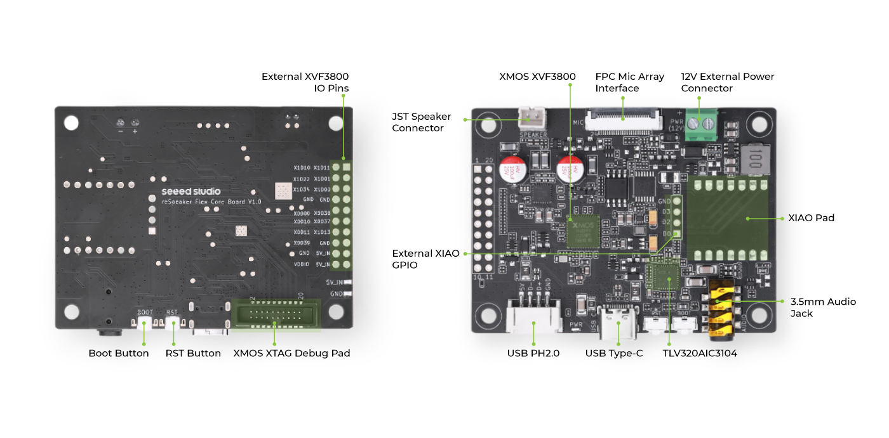
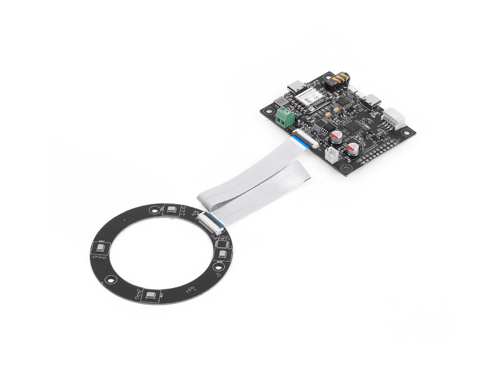
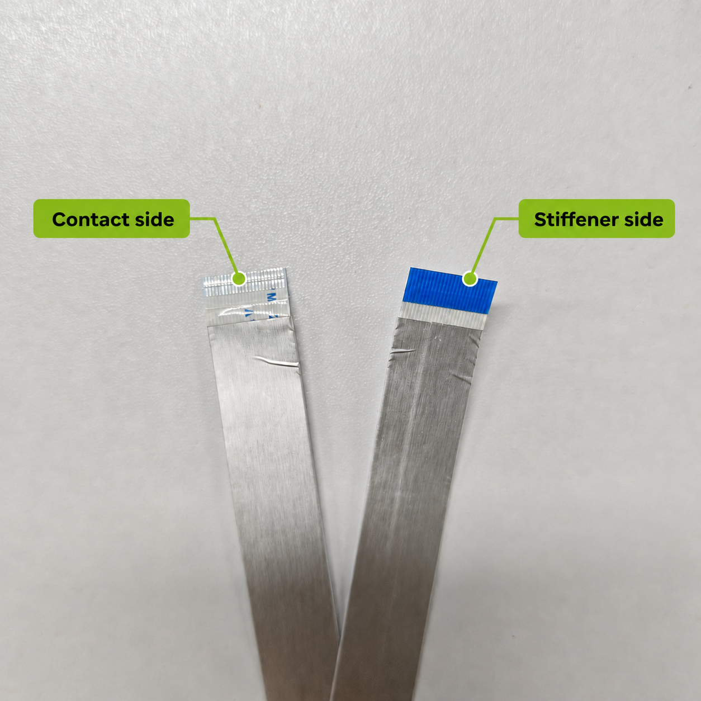
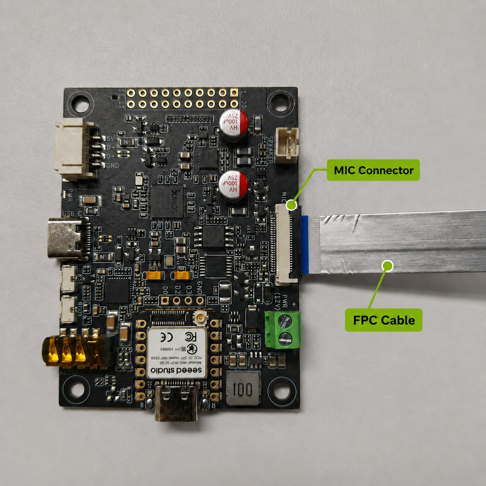
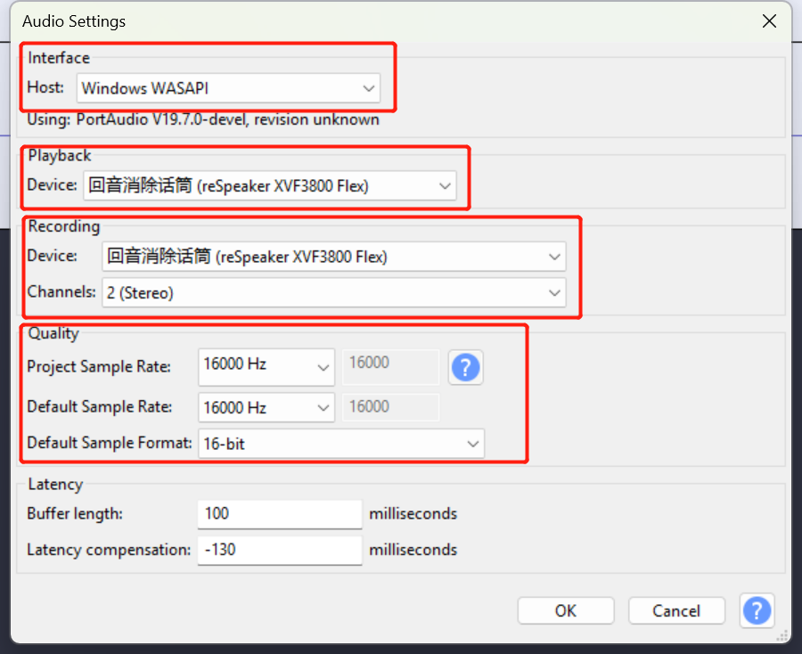

# reSpeaker Flex XVF3800 Circular-4 with XIAO ESP32S3
# Windows USB 声卡安装与固件升级

> 适用设备：reSpeaker Flex XVF3800 Circular-4 with XIAO ESP32S3  
> 适用系统：Windows 10/11  
> 文档验证日期：2026-08-31  
> 已验证固件：reSpeaker Flex Firmware v1.0.3，Circular 16 kHz / 2 Channel USB

本文介绍如何把带 XIAO ESP32S3 的 reSpeaker Flex 配置成 Windows USB 麦克风/扬声器，包括硬件连接、设备模式判断、Safe Mode、固件下载与校验、DFU 烧录、Windows 声卡验证和常见问题排查。

---

## 1. 先明确目标和设备架构

本指南的目标是让 Windows 通过 USB 直接使用 XVF3800：

```text
Circular-4 麦克风阵列
        |
        | FPC 排线
        v
Flex 核心板 / XVF3800
        |
        | 核心板 XMOS USB-C
        v
      Windows
```

板上的 XIAO ESP32S3 是另一台处理器：

```text
XVF3800 <-- I2S / I2C --> XIAO ESP32S3 <-- XIAO USB-C --> Windows COM/JTAG
```

因此：

- Windows USB 声卡、XVF3800 DFU：连接 **Flex 核心板的 XMOS USB-C**。
- ESP32 程序下载和串口调试：连接 **XIAO ESP32S3 自己的 USB-C**。
- XIAO 的 USB-C 不会自动把 XVF3800 转换成 Windows 声卡。
- ESP32-S3 的 BLE 不能直接替代 Windows USB 麦克风连接。

---

## 2. 识别核心板接口和按钮



图中最重要的三个位置：

1. **USB Type-C**：核心板底边中部，XVF3800 音频和 DFU 使用此接口。
2. **RST Button**：复位 XVF3800。
3. **Boot Button**：XVF3800 的 SafeMode/Boot 按钮，上电时按住可进入恢复模式。

> **不要混淆：** 带 XIAO 的型号还有 XIAO 小板自己的 USB-C 和 BOOT 按钮。进入 XVF3800 Safe Mode 时，必须按大核心板上丝印为 `BOOT` 的按钮。

设备整体外观如下：



---

## 3. 安装和检查 FPC 麦克风排线

操作排线前先断开 USB 和外部 12V 电源。

### 3.1 确认排线方向



排线有裸露触点的一面必须朝向连接器内部金属触点，加固片一面朝外。

### 3.2 锁紧连接器



1. 轻轻打开核心板和麦克风阵列板两端的 FPC 锁扣。
2. 将排线水平插到底，不要倾斜。
3. 合上两端锁扣。
4. 不要在锁扣关闭时强行抽插排线。

FPC 排线装反通常不会阻止 USB 设备枚举，但会导致无麦克风信号或算法工作异常。

---

## 4. 准备 Windows 和工具

### 4.1 准备 USB 数据线

使用确定支持数据传输的 USB-C 线。建议：

- 直接连接电脑 USB 端口，不经过扩展坞。
- 调试期间只连接核心板 XMOS USB-C。
- 暂时断开 XIAO USB-C 和外部 12V 电源，以确保真正冷启动。

### 4.2 安装 dfu-util 0.11

从 dfu-util 官方页面下载 Windows 版本并解压，例如：

```text
C:\dfu-util-0.11-binaries\win64\dfu-util.exe
```

在 PowerShell 中确认：

```powershell
$Dfu = "C:\dfu-util-0.11-binaries\win64\dfu-util.exe"
& $Dfu --version
```

PowerShell 执行绝对路径时应使用调用运算符 `&`。以下写法是错误的：

```powershell
# 错误：路径前不能写成 .c:\
.c:\dfu-util-0.11-binaries\dfu-util.exe
```

### 4.3 Zadig 只在必要时使用

只有 dfu-util 找到 reSpeaker 但报告以下错误时才需要 Zadig：

```text
LIBUSB_ERROR_NOT_SUPPORTED
Cannot open DFU device
```

在 Zadig 中：

1. 打开 `Options > List All Devices`。
2. 选择 `reSpeaker XVF3800 Safe Mode` 或 `reSpeaker XVF3800 Flex`。
3. 核对 VID 必须是 `2886`。
4. 安装 `WinUSB`。
5. 拔插设备后再次运行 `dfu-util -l`。

> **警告：** 不要给无关设备安装 WinUSB。特别是 `30c9:0050 APP Mode`，它可能是电脑的集成摄像头，不是 reSpeaker。

---

## 5. 判断当前设备模式

先把 USB 线连接到核心板 XMOS USB-C，然后运行：

```powershell
Get-PnpDevice -PresentOnly |
  Where-Object {
    $_.InstanceId -match 'VID_2886|VID_303A|VID_30C9' -or
    $_.FriendlyName -match 'reSpeaker|XVF3800|ESP32|XIAO'
  } |
  Format-Table Status, Class, FriendlyName, InstanceId -AutoSize
```

常见结果：

| USB 标识/设备 | 含义 | 下一步 |
|---|---|---|
| `2886:001c`，`reSpeaker Flex XVF3800 C16K2Ch` | 已运行 USB Audio 固件 | 无需刷写，直接进入第 9 节 |
| `2886:801c`，`reSpeaker XVF3800 Safe Mode` | 已进入新版 Flex Safe Mode | 进入第 7 节 |
| `2886:001a` | 部分文档或硬件版本的 reSpeaker 应用标识 | 根据设备名称和音频端点判断 |
| `303a:1001`，COM/JTAG | XIAO ESP32S3 | 当前连接的是 XIAO USB-C，或只检测到 XIAO |
| `30c9:0050 APP Mode` | 本机集成 RGB/IR 摄像头 | 忽略，绝对不要刷写 |
| 完全没有 `VID_2886` | XVF3800 未枚举 | 检查接口、线材并进入 Safe Mode |

带 XIAO 的 Flex 通常出厂使用 I2S 固件。I2S 固件不会作为 Windows USB 声卡出现，也可能不提供正常 USB DFU；这种情况需要使用 Safe Mode 切换到 USB 固件。

---

## 6. 进入 XVF3800 Safe Mode

1. 拔掉核心板 USB-C、XIAO USB-C 和外部 12V 电源。
2. 找到大核心板上丝印为 `BOOT` 的按钮。
3. 按住 `BOOT` 不放。
4. 将 USB 数据线插入大核心板的 XMOS USB-C。
5. 保持按住约 2 到 3 秒，然后松开 `BOOT`。
6. 不要按 `RST`，也不要按 XIAO 小板上的 BOOT。

运行：

```powershell
$Dfu = "C:\dfu-util-0.11-binaries\win64\dfu-util.exe"
& $Dfu -l
```

本设备已验证的正确输出类似：

```text
Found DFU: [2886:801c] ... alt=2, name="reSpeaker DFU DataPartition"
Found DFU: [2886:801c] ... alt=1, name="reSpeaker DFU Upgrade"
Found DFU: [2886:801c] ... alt=0, name="reSpeaker DFU Factory"
```

分区用途：

| Alternate setting | 名称 | 用途 |
|---:|---|---|
| `alt=0` | DFU Factory | Safe Mode/工厂恢复分区，不要覆盖 |
| `alt=1` | DFU Upgrade | 应用固件升级分区，本指南只写这里 |
| `alt=2` | DFU DataPartition | 数据/配置分区，不要覆盖 |

只有明确看到 `VID=2886`、`DFU Upgrade` 和 `alt=1` 后，才继续烧录。

---

## 7. 下载并校验 USB 固件

### 7.1 选择正确固件

本设备是 Circular-4 圆形阵列。首次验证建议使用：

```text
respeaker_flex_usb_c16k2ch_v1.0.3.bin
```

文件名含义：

- `usb`：Windows/macOS/Linux USB Audio 固件。
- `c`：Circular 圆形麦克风阵列。
- `16k`：16 kHz 采样率。
- `2ch`：双通道。

不要选择：

- 文件名含 `i2s` 的固件：它用于 ESP32 等嵌入式 I2S 主机。
- 文件名含 `l` 的固件：它用于 Linear 线性阵列。
- 旧款一体式 XVF3800 的固件：它不是 Flex 固件。

### 7.2 PowerShell 下载

```powershell
$DfuDir = "C:\dfu-util-0.11-binaries\win64"
$FirmwareName = "respeaker_flex_usb_c16k2ch_v1.0.3.bin"
$Firmware = Join-Path $DfuDir $FirmwareName
$FirmwareUrl = "https://github.com/respeaker/reSpeaker_Flex/releases/download/v1.0.3/$FirmwareName"

Invoke-WebRequest $FirmwareUrl -OutFile $Firmware
```

### 7.3 校验 SHA-256

```powershell
(Get-FileHash $Firmware -Algorithm SHA256).Hash
```

v1.0.3 圆形 16 kHz 双通道固件的正确值：

```text
E28FE30F98843671317B00D340AE02D78F2B84033F74A159806BC8E1086A2D4E
```

如果哈希不一致，不要烧录；删除文件后重新下载。

> 发布版本将来可能更新。上述文件名和哈希只适用于 v1.0.3。使用其他版本时应以对应 GitHub Release 公布的哈希为准。

---

## 8. 烧录 USB Audio 固件

确保设备仍处于 Safe Mode，并再次确认：

```powershell
& $Dfu -l
```

执行烧录：

```powershell
$Dfu = "C:\dfu-util-0.11-binaries\win64\dfu-util.exe"
$Firmware = "C:\dfu-util-0.11-binaries\win64\respeaker_flex_usb_c16k2ch_v1.0.3.bin"

& $Dfu -d 2886:801c -R -e -a 1 -D $Firmware
```

参数说明：

| 参数 | 含义 |
|---|---|
| `-d 2886:801c` | 只选择 reSpeaker Safe Mode，避免误选其他 DFU 设备 |
| `-a 1` | 只写 DFU Upgrade 应用分区 |
| `-D` | 下载指定固件到设备 |
| `-e` | 完成后离开 DFU 状态 |
| `-R` | 完成后复位设备并进入运行模式 |

烧录过程中不要拔线、按按钮或关闭 PowerShell。

成功输出的关键部分：

```text
Device ID 2886:801c
Setting Alternate Interface #1 ...
Download [=========================] 100% 929792 bytes
Download done.
status(0) = No error condition is present
Done!
Resetting USB to switch back to Run-Time mode
```

以下提示在 dfu-util 0.11 搭配官方原始 `.bin` 时不代表失败：

```text
Warning: Invalid DFU suffix signature
A valid DFU suffix will be required in a future dfu-util release
```

只要随后显示 `Download done`、`No error` 和 `Done!`，本次烧录就是成功的。

---

## 9. 验证 Windows USB 声卡

命令含 `-R`，烧录完成后板子会自动复位，因此通常不需要手动按 `RST` 或再次拔插。

等待 Windows 安装驱动，然后运行：

```powershell
Get-PnpDevice -PresentOnly |
  Where-Object {
    $_.InstanceId -match 'VID_2886' -or
    $_.FriendlyName -match 'reSpeaker|XVF3800'
  } |
  Format-Table Status, Class, FriendlyName, InstanceId -AutoSize
```

本设备已验证的正常结果包括：

```text
USB\VID_2886&PID_001C     reSpeaker Flex XVF3800 C16K2Ch
MEDIA                     reSpeaker Flex XVF3800 C16K2Ch
AudioEndpoint             Echo Cancelling Speakerphone (...)
```

Windows 应使用以下驱动：

```text
USB Audio 2.0: usbaudio2.inf
Audio Endpoint: audioendpoint.inf
```

检查音频端点：

```powershell
Get-PnpDevice -PresentOnly |
  Where-Object {
    $_.Class -in @('AudioEndpoint', 'MEDIA') -and
    $_.FriendlyName -match 'reSpeaker|XVF3800|Echo Cancelling'
  } |
  Format-Table Status, Class, FriendlyName -AutoSize
```

输入和输出端点的 `Status` 都应为 `OK`。

---

## 10. Windows 录音测试

### 10.1 使用 Windows 声音设置

1. 打开 `设置 > 系统 > 声音`。
2. 在“输入”中选择：

   ```text
   Echo Cancelling Speakerphone (reSpeaker Flex XVF3800 C16K2Ch)
   ```

3. 对着圆形麦克风板讲话。
4. 检查输入音量条是否变化。
5. 如需播放/AEC 回声参考，在“输出”中选择同名设备。

还应检查：

- `设置 > 隐私和安全性 > 麦克风` 中已允许麦克风访问。
- 麦克风没有被应用独占或静音。
- 麦克风阵列的拾音孔朝向声源。

### 10.2 使用 Audacity

建议设置：

| 项目 | 设置 |
|---|---|
| Host | Windows WASAPI |
| Recording Device | reSpeaker Flex XVF3800 / Echo Cancelling Speakerphone |
| Channels | 2 (Stereo) |
| Sample Rate | 16000 Hz |
| Sample Format | 16-bit |



---

## 11. 常见问题排查

### 11.1 `dfu-util -l` 只显示 `30c9:0050 APP Mode`

原因：该设备是电脑集成摄像头的 DFU 接口，不是 reSpeaker。

处理：

- 不要对 `30c9:0050` 执行任何下载命令。
- 确认 USB 插在 Flex 大核心板上靠近 `RST` 的 XMOS USB-C。
- 按第 6 节重新进入 Safe Mode。
- 正确 reSpeaker VID 应为 `2886`。

### 11.2 Windows 只看到 `303a:1001`、COM 端口或 USB JTAG

原因：这是 XIAO ESP32S3。

处理：

- 将 USB 线从 XIAO 小板 USB-C 移到 Flex 核心板 XMOS USB-C。
- 如果仍无声卡，按第 6 节进入 XVF3800 Safe Mode 并烧录 USB 固件。

### 11.3 看不到任何 `VID_2886`

依次检查：

1. 是否使用核心板 XMOS USB-C，而非 XIAO USB-C。
2. USB 线是否支持数据传输。
3. 是否直接连接电脑而不是扩展坞。
4. 是否先完全断电，再按住核心板 `BOOT` 插入 USB。
5. 换一根已知可传数据的线或另一个电脑 USB 端口。

在 Windows 完全没有枚举 `VID_2886` 时，Zadig不能解决线材、端口或上电时序问题。

### 11.4 `Cannot open DFU device` / `LIBUSB_ERROR_NOT_SUPPORTED`

按照第 4.3 节，只给 VID `2886` 的 reSpeaker Safe Mode 接口安装 WinUSB，然后拔插设备。

### 11.5 烧录后设备存在但没有音频端点

1. 打开设备管理器。
2. 找到硬件 ID 包含 `VID_2886` 的 reSpeaker 相关设备。
3. 右键选择“卸载设备”。
4. 不要卸载其他厂商设备。
5. 拔插核心板 XMOS USB-C，让 Windows 重新安装 USB Audio 2.0 驱动。

### 11.6 声卡存在但没有录音信号

依次检查：

1. Windows 输入设备是否选中 reSpeaker。
2. 麦克风隐私权限是否开启。
3. 麦克风是否静音。
4. FPC 排线两端是否插到底并锁紧。
5. FPC 裸露触点方向是否正确。
6. Audacity 是否设置为 16 kHz、16-bit、双通道。
7. 重新按一次核心板 `RST`，等待声卡重新枚举。

### 11.7 是否需要手动 reboot

正常成功烧录命令包含 `-R`，设备已自动复位。如果 Windows 已看到 `reSpeaker Flex XVF3800 C16K2Ch`，无需再次 reboot。

只有设备卡死或音频端点未重新出现时，才尝试：

1. 短按核心板 `RST`；或
2. 拔插核心板 XMOS USB-C。

正常使用时不要按住 `BOOT` 上电，否则会再次进入 Safe Mode。

### 11.8 能否通过 ESP32-S3 蓝牙直接当 Windows 麦克风

不能直接使用出厂配置实现。XIAO ESP32S3 主要提供 BLE，而且出厂固件没有实现 Windows 蓝牙耳麦协议桥接。

无线传输需要自行开发，例如：

```text
XVF3800 I2S 固件 -> ESP32-S3 I2S 采集 -> Wi-Fi 音频流 -> Windows 接收程序
```

这与本指南的 USB Audio 模式是两种不同方案。

---

## 12. 最终检查清单

- [ ] FPC 排线方向正确且两端锁紧。
- [ ] USB 连接到 Flex 核心板 XMOS USB-C。
- [ ] `dfu-util -l` 中 reSpeaker VID 是 `2886`。
- [ ] 未把 `30c9:0050 APP Mode` 当成 reSpeaker。
- [ ] 下载的是 Flex、Circular、USB 固件。
- [ ] 固件 SHA-256 校验通过。
- [ ] 只烧录 `alt=1 / DFU Upgrade`。
- [ ] 烧录输出包含 `Download done`、`No error` 和 `Done!`。
- [ ] Windows 中存在 `reSpeaker Flex XVF3800 C16K2Ch`。
- [ ] reSpeaker 的输入和输出 AudioEndpoint 状态均为 `OK`。
- [ ] Windows 输入音量条或 Audacity 录音波形会随讲话变化。

---

## 13. 参考资料

- [Seeed Studio：reSpeaker Flex 入门指南](https://wiki.seeedstudio.com/cn/respeaker_flex_introduction/)
- [Seeed Studio：搭配 XIAO ESP32S3 的 reSpeaker Flex](https://wiki.seeedstudio.com/cn/respeaker_flex_xiao_introduction/)
- [reSpeaker Flex 官方 GitHub 仓库](https://github.com/respeaker/reSpeaker_Flex)
- [reSpeaker Flex Firmware v1.0.3](https://github.com/respeaker/reSpeaker_Flex/releases/tag/v1.0.3)
- [dfu-util 官方网站](https://dfu-util.sourceforge.net/)
- [Zadig 官方网站](https://zadig.akeo.ie/)

本文使用的产品和接线图片来自 Seeed Studio 官方 Wiki，并已保存到 `images/` 目录供离线查看。
